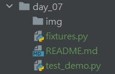

# Python 與自動化測試的敲門磚_Day07_Pytest 與 Fixture

每天的專案會同步到 github 上，可以前往 [這個網址](https://github.com/nickchen1998/2022_ithelp_marathon)
如果對於專案有興趣或是想討論一些問題，歡迎留言 OR 來信討論，信箱為：nickchen1998@gmail.com

昨天有提到在 pytest 當中有一個叫做 fixture 的功能，可以做到類似 setup、teardown 的功能，
fixture 和他們最大的差別在於，fixture 可以參數化，並且可以回傳出參數提供其他 test case 做使用，
今天我們就來好好介紹他

## 一、fixture 快速入門
### (一)、目錄架構
在開始撰寫之前，先介紹一下本次的目錄架構，由於不想造成程式碼太過混亂，fixture 的部分會存放在 fixtures.py 當中，
要使用的時候再使用 import 進來進行使用，而各個 test case 則是寫在 test_demo.py 當中



### (二)、快速建立 fixture
- fixtures.py
    - fixture 裝飾器參數介紹
      - scope：表示作用域，預設為 "function"，亦即每個有用到此 fixture 的 test case 都會執行，另外還有 module、class 以及 session 三種
      - name：用來設定 fixture 的別名，預設為函式名稱
      - autouse：預設為 False，若為 True，則會自動進行使用 (根據 scope 作用域而定)

    - 程式解釋
      - 利用 `@pytest.fixture` 標註該函式為 fixture
      - 利用 fake_useragent 隨機生成一個 User-Agent (需另外安裝 fake-useragent 套件)
      - 回傳 headers 給有使用此 fixture 的 test case
```python
import pytest
from fake_useragent import FakeUserAgent


@pytest.fixture(name="headers", scope="function", autouse=False)
def headers_fixture() -> dict:
    ua = FakeUserAgent()
    headers = {"User-Agent": ua.random}

    return headers
```

### (三)、使用 fixture
接著我們回到 test_demo.py 當中，來使用剛剛所製作的 fixture。使用的方式則非常簡單，首先我們必須將剛剛撰寫好的 fixture 的 function 給 import
進來，這樣 pytest 才抓地到，接著只需要在 test case 接收參數的地方打上剛剛為 fixture 命名的名稱 (若無則預設為 fixture 的 function name)，
接著我們就可以在 test case 內使用此 fixture 回傳出的內容了。

程式碼解析：
1. 將要使用 fixture 先進行 import
2. 利用 `https://httpbin.org/headers` 來取得我們送出去的 headers
3. 最後驗證取得的 headers 和我們利用 fixture 製作的 headers 是否相等

備註：本測試範例只使用了一個 fixture 作為展示，實際上一個 test case 可以同時使用多個 fixture 是沒問題的
```python
import requests
from fixtures import headers_fixture

# 單純不讓 pycharm 跳驚嘆號，沒有實際用途
use_fixtures = [headers_fixture]


def test_assert_headers(headers: dict):
    url = "https://httpbin.org/headers"  
    res = requests.get(url=url, headers=headers)

    print(res.status_code)
    print(res.json())

    assert res.status_code == 200
    assert res.json()['headers']["User-Agent"] == headers["User-Agent"]
```

## 二、fixture 的互相使用
fixture 除了可以在 test case 當中使用，同樣也可以在不同的 fixture 間使用，下面用一個簡單的例子來介紹。

### (一)、範例程式
簡單來說，就是將前面原本寫在 test_case 內取出 User-Agent 的部分，抽出來另外撰寫一個 fixture 做處理，
這樣 test_case 內就只需要負責進行驗證即可。

- fixtures.py
  - make_useragent：產出一組 User-Agent
  - parse_user_agent：使著進行請求，並擷取回傳的 User-Agent 部分
```python
@pytest.fixture(name="make_user_agent", scope="function", autouse=False)
def make_user_agent_fixture() -> dict:
    ua = FakeUserAgent()
    headers = {"User-Agent": ua.random}

    return headers


@pytest.fixture(name="parse_user_agent", scope="function", autouse=False)
def parse_user_agent_fixture(make_user_agent: dict) -> dict:
    url = "https://httpbin.org/headers"
    res = requests.get(url=url, headers=make_user_agent)
    user_agent = res.json()["headers"]['User-Agent']

    return {"User-Agent": user_agent}
```
- test_demo.py
  - 進行驗證兩個 fixture 所產生的 User-Agent 是否相等
```python
from fixture import parse_user_agent_fixture, make_user_agent_fixture

use_fixtures = [make_user_agent_fixture, parse_user_agent_fixture]


def test_assert_user_agent(make_user_agent: dict, parse_user_agent: dict):
    assert make_user_agent == parse_user_agent
```

### (二)、fixture 使用時機
- 為 test case 建立環境時
  - 若是有很多個 test case 在測試前需要做一些環境的建置、參數的準備，則很適合適用 fixture
- 當你不想使用 setup、teardown 時
  - 由於使用 setup、teardown 會造成該 .py 檔內的所有 test case 都被引響，而 fixture 若沒有被寫在 test case 接收的參數內，則不會被影響 (除非作用域不為 function 且 autouse=False)

## 三、內容預告
今天我們介紹了 fixture 的一些基本用法，相信 fixture 可以很好的協助我們進行測試程式的撰寫，讓測試程式越來越集中在驗證該驗證的東西上，
而不是寫了一堆和想驗證的東西無關的程式

明天我們會教大家兩個虛擬的資料庫，讓我們可以在不用建立實體資料庫的情況下，就可以測試一些和資料庫操作有關的函式，
而這個部分則會搭配今天所教的 fixture 進行使用