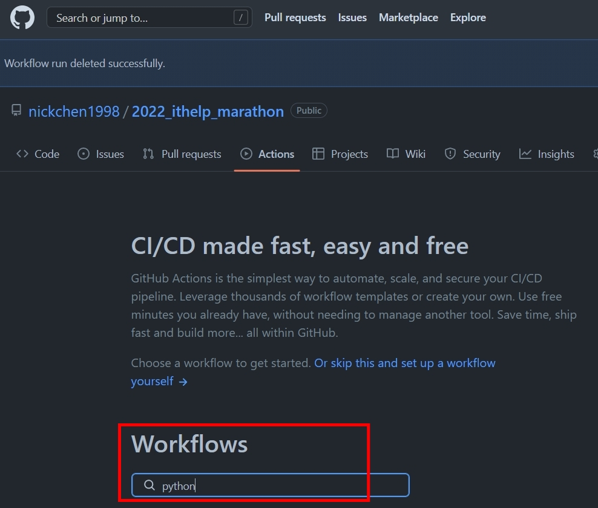
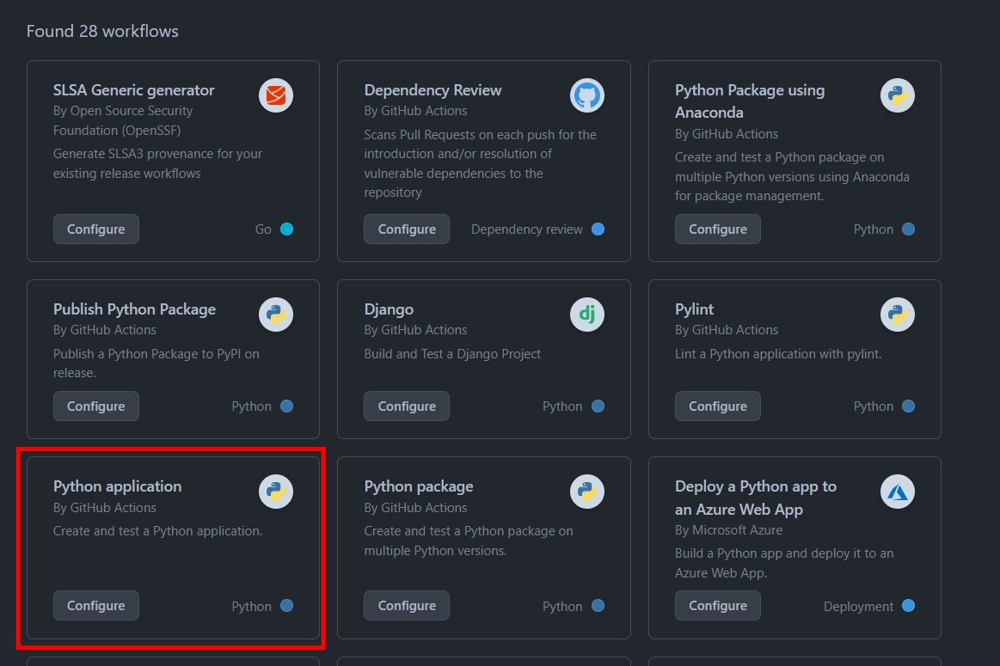
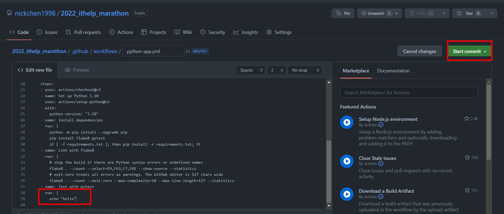
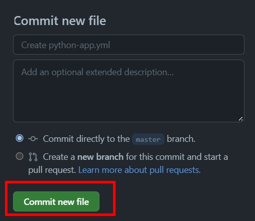
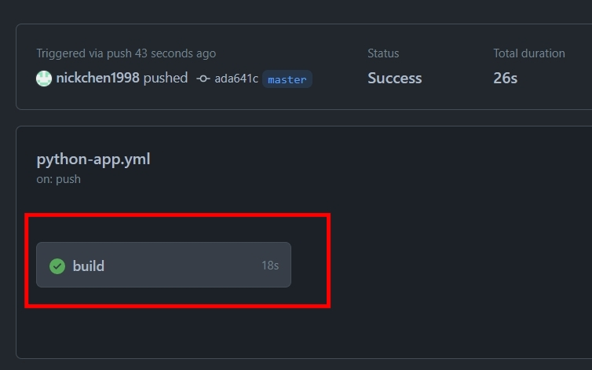
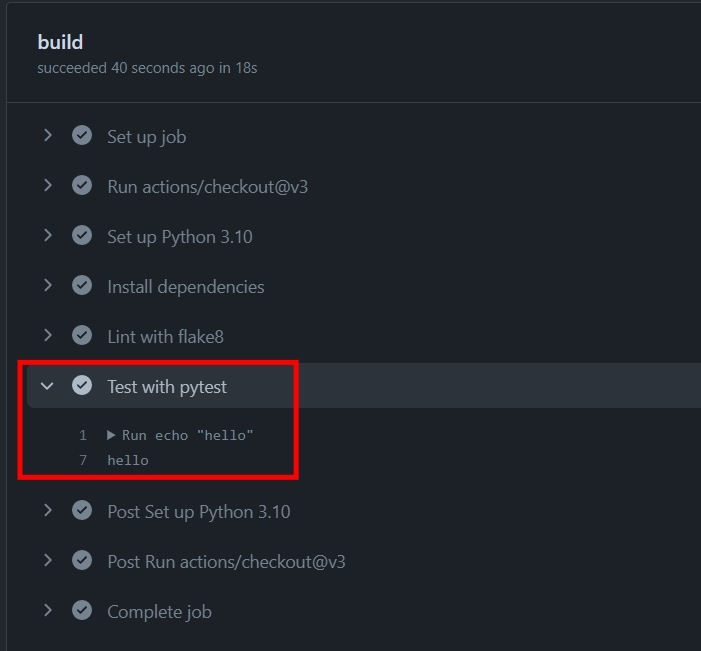
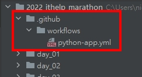
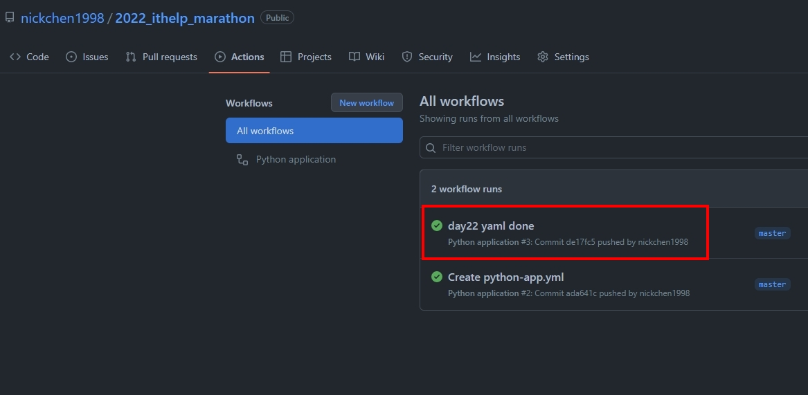
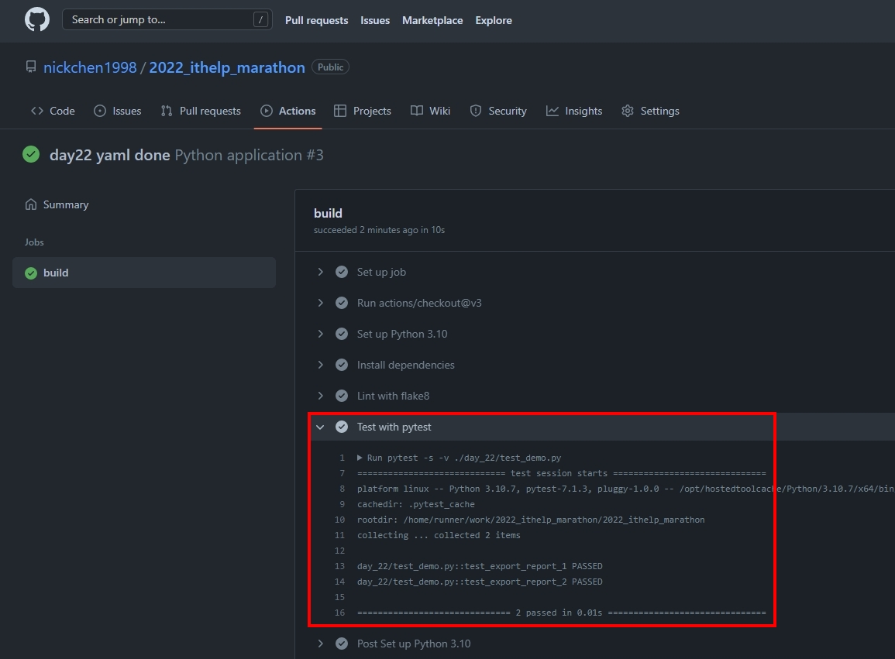

# Python 與自動化測試的敲門磚_Day22_Github Actions 快速速們

每天的專案會同步到 github 上，可以前往 [這個網址](https://github.com/nickchen1998/2022_ithelp_marathon)
如果對於專案有興趣或是想討論一些問題，歡迎留言 OR 來信討論，信箱為：nickchen1998@gmail.com

今天我們要來介紹 Github Actions 這個工具，他是 2019 年 Github 推出的 CI 工具，我們可以透過他來協助我們進行簡單的自動化測試

## 一、建立 yml file

- 進入 github 專案並點選 Actions 選項
    
    

- 在 Workflows 欄位底下輸入 "python" 進行搜尋

    

- 選擇 Python Application，並點選 Configure 選項

    

- 將跳轉後出現的頁面的程式碼滑到最底下，並將 `pytest` 更改為 `echo "hello"`
- 點選右上方 "Start Commit" 選項

    

- 點選 "Commit new file" 選項

    

- 頁面會自動跳轉回專案首頁，請點選回 "Actions"，就可以看到 github 按照剛剛建立的檔案建立了一個 CI 任務

    

- 點進此任務，並選擇 build 選項

    

- 點選 "Test with pytest" 部分即可看到剛剛修改的 echo "hello"

    

## 二、修改 yml
- 由於我們剛剛是直接在 github 上進行 commit 來新增 workflows，因此我們要先回到專案上執行 git pull 確保專案同步
- 執行完 git pull 後即可在專案上看到 ".github" 這個目錄，並且有 "workflows" 這個子目錄
- "workflows" 目錄下會有一個 python-app.yml 檔案，這個就是我們等一下要修改的檔案

  

- 在修改 yml 前我們先建立幾個簡單的 test case 並存放到 day_22/test_demo.py 目錄下
  
  
  ```python
    def test_export_report_1():
        a = 1 + 1
        b = 2 + 2

        assert b > a


    def test_export_report_2():
      a = 2 + 2
      b = 4 + 4
  
      assert a < b
  ```
- 打開 python-app.yml 
- 將剛剛的 `echo "hello"` 修改為 `pytest -s -v ./day_22/test_demo.py`
    
  ```yaml
  # This workflow will install Python dependencies, run tests and lint with a single version of Python
  # For more information see: https://help.github.com/actions/language-and-framework-guides/using-python-with-github-actions
  
  name: Python application
  
  on:
    push:
      branches: [ "master" ]
    pull_request:
      branches: [ "master" ]
  
  permissions:
    contents: read
  
  jobs:
    build:
  
      runs-on: ubuntu-latest
  
      steps:
      - uses: actions/checkout@v3
      - name: Set up Python 3.10
        uses: actions/setup-python@v3
        with:
          python-version: "3.10"
      - name: Install dependencies
        run: |
          python -m pip install --upgrade pip
          pip install flake8 pytest
          if [ -f requirements.txt ]; then pip install -r requirements.txt; fi
      - name: Lint with flake8
        run: |
          # stop the build if there are Python syntax errors or undefined names
          flake8 . --count --select=E9,F63,F7,F82 --show-source --statistics
          # exit-zero treats all errors as warnings. The GitHub editor is 127 chars wide
          flake8 . --count --exit-zero --max-complexity=10 --max-line-length=127 --statistics
      - name: Test with pytest
        run: |
          pytest -s -v ./day_22/test_demo.py
  ```
  
## 三、察看結果
修改完成後，我們就可以將整個專案 push 到 Github 上，這個時候我們就可以回到剛剛的 "Actions" 頁面察看結果了

下圖中我們可以看到 Acitons 這邊多了一個任務，任務名稱會使用剛剛的 commit message 命名


點進去該任務後就可以查看 pytest 的執行結果了


## 四、內容預告
今天我們簡單介紹了該如何使用 Github Actions，過程中有請各位編輯 python-app.yml 這個檔案，
明天我們直接藉由這個檔案來介紹，該如何編輯我們的工作流程